# Drone Design Studio ユーザーマニュアル

飛行体（固定ピッチの多ロータ機）のシミュレーション、推進系と電気系の設計、基板設計、機体設計を一貫して行うツールの使い方です。設計の経緯と検証結果は `reports/index.html`（総合レポート）にまとめています。

- 画像はすべて `npm run manual` で撮り直せます（`docs/img/`）。
- 数値はシミュレーションと計算上の値です。実機での確認が必要な点は各レポートの「懸念点」を参照してください。

## 1. 準備と起動

```bash
npm install
npm run dev        # http://localhost:5173 を開く
```

UI は、設計スクリプトが出力した `out/` のデータを読み込んで表示します。初回、または設計を変えたときは先に次を実行します。

```bash
npm run all        # 段階1〜5（版 A）のゴール判定・成果物・レポート
npm run variantB   # 改良版 B（センサ子基板＋GNSS 端子）
npm run variantC   # 改良版 C（屋外機）
npm run city       # 都市シミュレーション（横浜・みなとみらい）※版 C の後に実行
```

## 2. 画面構成

画面上部に 6 つのタブ、右上に「設計の版」の選択があります。

| タブ | 内容 |
|---|---|
| 1 シミュレーション | 参照機の飛行シミュレーション（屋内コース、手動飛行） |
| 2 推進・電気 | モータ・プロペラ・電池の探索、回路、電気計算 |
| 3 部品・基板 | 自動配置・配線した基板（2D/3D）、部品 3D ライブラリ、製造データ |
| 4 機体 | フレームと完成機体の 3D、重心・隙間・強度の検証結果 |
| 5 統合 | 設計した機体そのものの 3D でシミュレーション |
| 6 都市（横浜） | みなとみらいの建物の中で版 C を飛ばす |

| 版 | 内容 |
|---|---|
| 版 A（元設計） | 1S ブラシ付きのマイクロ機。フロー＋ToF は既製モジュール |
| 版 B | フロー＋ToF を自作の子基板にし、GNSS 端子を追加 |
| 版 C | 屋外機（ブラシレス 2S、市販 4-in-1 ESC、GNSS、自動帰還） |

版の選択は 3〜5 のタブに反映されます。

## 3. タブごとの使い方

### 3.1 シミュレーション

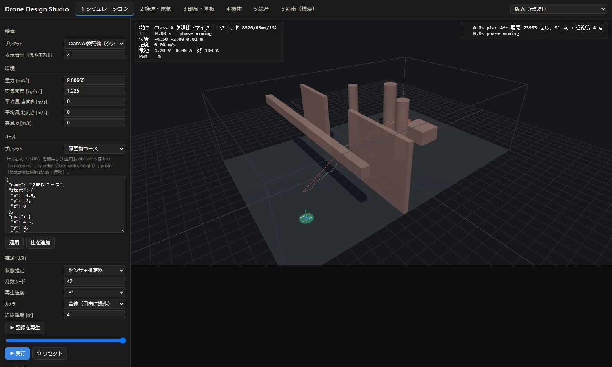

- **機体**: 参照機（マイクロ・クアッド、ヘキサ、250 級）を選びます。
- **コース**: プリセットを選ぶか、JSON を編集して「適用」します。「柱を追加」で障害物を置けます。
- **環境**: 風（平均・突風）、空気密度、重力を変えられます。
- **推定・実行**: 「状態推定」は、センサ誤差ありのフィルタか真値かを選びます。乱数シード、再生速度も設定できます。「▶ 実行」で飛行します。
- **手動飛行**: 「手動モード」をオンにすると、キーボードで操縦できます。W/S で前後、A/D で左右、Q/E でヨー、R/F で上昇・下降です。
- **ゴール判定**: G1-1〜G1-5 のボタンで判定シナリオを最後まで実行し、軌跡と判定結果を表示します。
- 3D 表示で、オレンジの破線は計画経路、青線は実際の軌跡です。下段に高度と電池電圧のグラフが出ます。

**カメラと記録の再生**（1・5・6 のタブ共通）

| カメラ | 動き |
|---|---|
| 全体（自由に操作） | マウスで自由に回転・ズームできます（既定） |
| 機体を追従（マウスで回転・ズーム可） | 機体に合わせて移動し、見る角度はマウスで変えられます |
| 機体の後方から追従 | 進行方向の後ろ上方から自動で追いかけます |
| 機体の真上から追従 | 真上から見下ろして追いかけます |

- 「追従距離 [m]」で、機体とカメラの距離を変えられます。
- ゴール判定のシナリオを実行した後は、「▶ 記録を再生」で飛行を最初から再生できます。スライダーで好きな時刻へ移動でき、再生速度は「再生速度」に従います。
- URL でも指定できます。例：`?tab=city&scenario=GY-4&cam=chase&camDist=4&at=150`（`at` は再生位置 [s]）

### 3.2 推進・電気

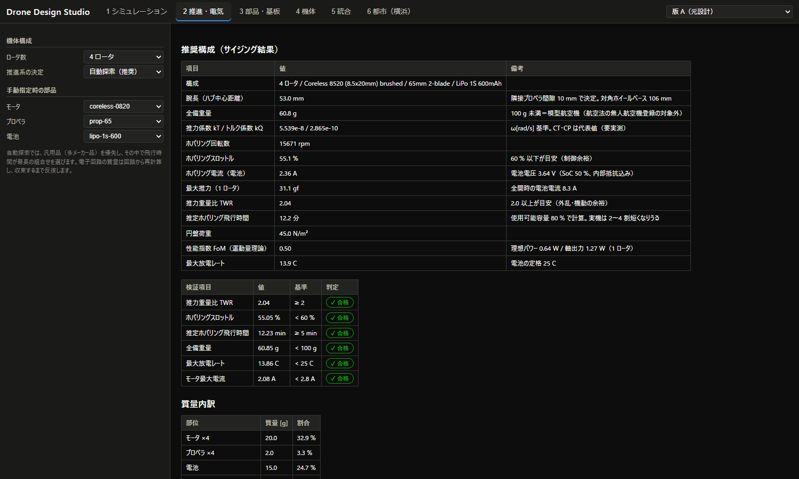

ロータ数と推進系の決め方（自動探索／手動指定）を選ぶと、推力重量比・ホバリングスロットル・飛行時間・電気計算がその場で再計算されます。

### 3.3 部品・基板

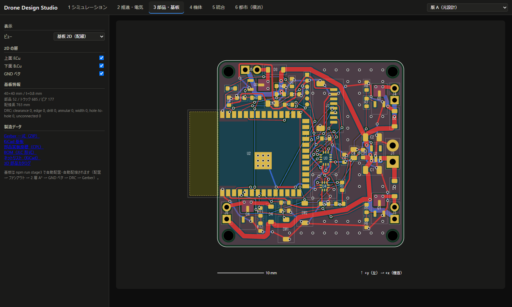

- **ビュー**: 2D、実装済み基板の 3D（上面・下面）、部品 3D ライブラリ、ブレッドボード配置から選びます。
- **2D の層**: 上面・下面の銅箔と GND ベタの表示を切り替えます。
- **製造データ**: Gerber（ZIP）、KiCad 基板、実装座標（CPL）、BOM をダウンロードできます。
- 版 B では「基板」でメイン基板とセンサ子基板を切り替えます。

### 3.4 機体

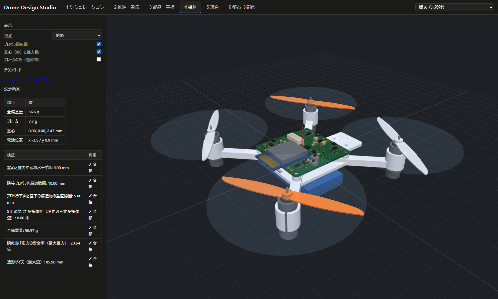

視点、プロペラ回転面、重心と推力軸、「フレームのみ（造形物）」を切り替えられます。3D プリント用のフレーム STL もここからダウンロードできます。

版 C を選ぶと、ブラシレスモータのボルト固定台座、ESC の段積み、機首上の GNSS が表示されます。

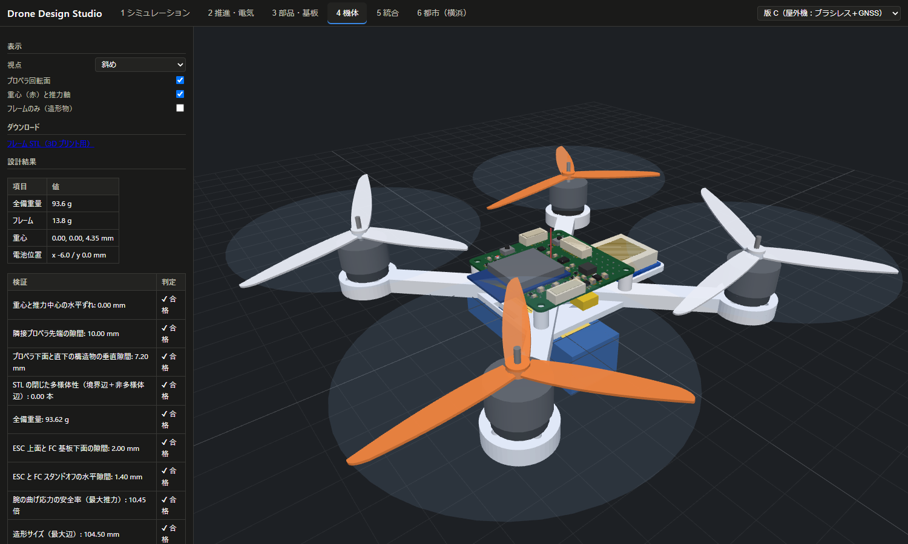

### 3.5 統合

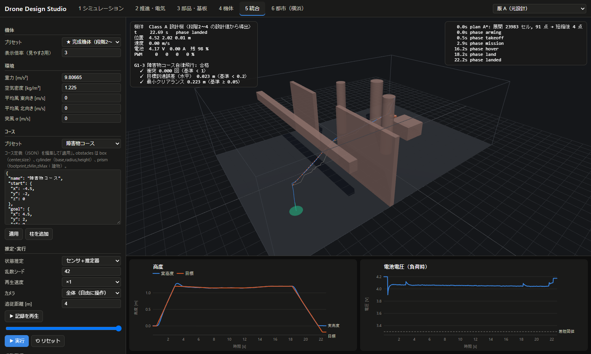

段階 2〜4 の設計値から導いたパラメータで、完成機体の 3D モデルが飛びます。版 C では屋外シナリオ（GC-5a〜GC-6、自動帰還を含む）を選べます。

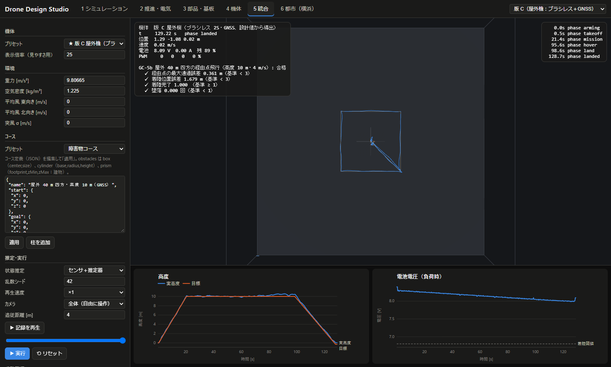

> 版 C は位置を GNSS（誤差約 1 m）で測るので、屋内の障害物コースは飛べません。屋外シナリオを使ってください。

### 3.6 都市（横浜・みなとみらい）

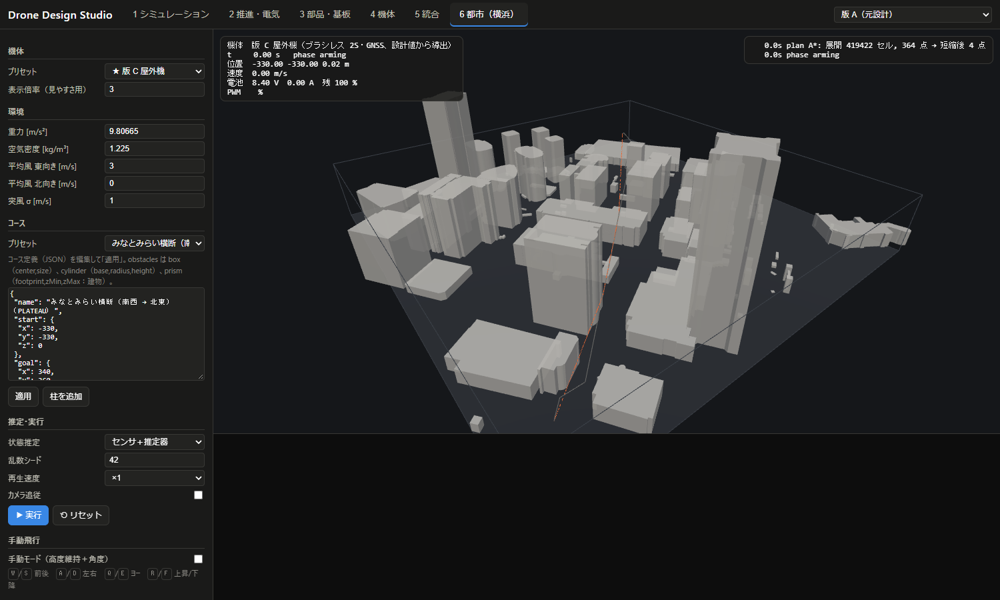

みなとみらいの約 800 m 四方の建物を読み込み、版 C を建物の間で飛ばします。

**準備**

```bash
npm run variantC   # 版 C の機体パラメータ（out/variantC/drone_params.json）
npm run city       # 建物データの取得・変換、経路計画、飛行検証、reports/city.html
```

初回だけ、インターネットから建物データを取得します。取得したデータは `.cache/city/` に保存され、2 回目以降はそれを使います。

- **PLATEAU**: 市全体で 2.7 GB の ZIP から、必要な 2 区画（約 100 MB）だけを部分的にダウンロードします。
- **OpenStreetMap**: Overpass API に 1 回問い合わせます。

**使い方**

- 左の「ゴール判定」から都市シナリオを選ぶと、飛行を最後まで計算して軌跡を表示します。計算には数秒かかります。

| シナリオ | 内容 |
|---|---|
| GY-3 | 開けた空を仮定した GNSS、安全余裕 3 m |
| GY-4a | ビル街の GNSS 劣化＋高さの風、安全余裕 3 m（試行。建物に接触する場合がある） |
| GY-4 | 同じ条件で安全余裕 8 m（全シードで接触なし） |

- 「▶ 実行」でリアルタイムに飛ばすこともできます。オレンジの破線が計画経路、青線が軌跡です。
- 全体を見るときは、機体が小さいので「表示倍率」を 20〜40 にすると見やすくなります。

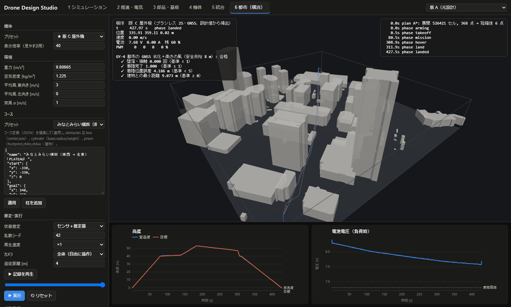

広い範囲では機体が小さく見えるので、カメラを「機体の後方から追従」や「機体の真上から追従」にし、「▶ 記録を再生」で飛行を追いかけると見やすくなります。

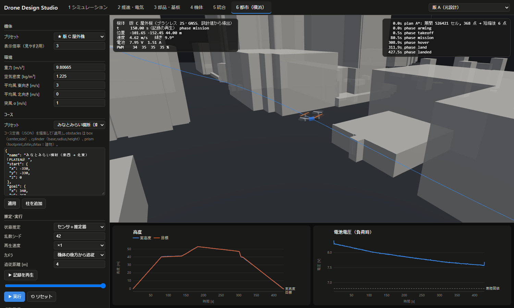

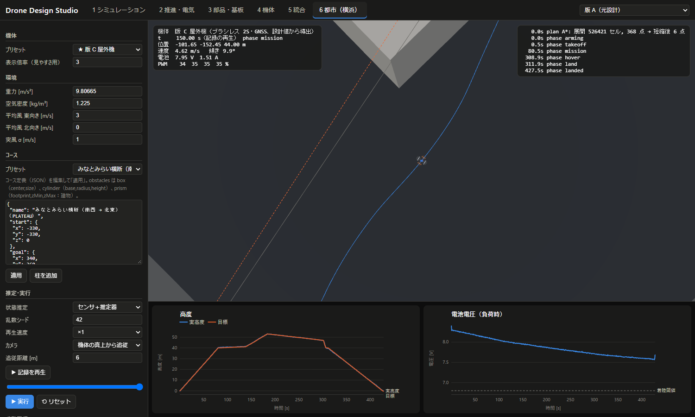

**モデルの考え方**

- **建物**: PLATEAU の建築物（LOD1）を「外形 × 高さ」の角柱として、当たり判定と経路計画に使います。OSM は比較用です（高さタグがない建物は、階数 × 3.2 m、または既定 10 m で補っています）。
- **GNSS 劣化**: 地点ごとに、建物に遮られない空の割合（天空見通し率）を計算します。空が狭いほど誤差を拡大し、極端に狭い所では測位できないものとします（経験的なモデル）。
- **風**: 地上 10 m の風を基準に、高さのべき乗則で強くなります。ビル風は再現していません。
- **経路計画**: 2 m 格子の A* で計画します。建物からの安全余裕は、機体の大きさより GNSS の誤差で決まります（レポートの GY-4a → GY-4 を参照）。
- **法規チェック**: 飛行高度、公園の上空、人口集中地区などの注意点をレポートに出します。これはシミュレーション上の確認で、実際に飛ばせるかの判断ではありません。

**対象地域を変えるには**

`src/core/presets.ts` の `CITY_AREA_MINATOMIRAI` を変更します。

- `origin`: 原点の緯度経度
- `halfSize`: 範囲の半幅 [m]
- `meshes`: 範囲を含む 3 次メッシュコード
- `plateau.url`: その市の PLATEAU CityGML の ZIP

経路の始点・終点・高度は `src/integration/city.ts` の `CITY_ROUTE` で変えられます。

**データの出典表示**

- 「3D 都市モデル（Project PLATEAU）横浜市（2024 年度）」（国土交通省）を加工して作成
- © OpenStreetMap contributors（ODbL）

## 4. 予算（部品価格）

```bash
npm run budget     # reports/budget.html、out/budget/budget.csv
```

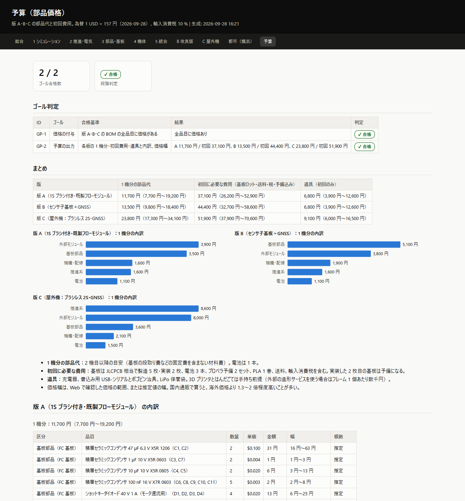

版 A・B・C の BOM と部品価格表から、3 種類の費用を計算します。

| 費用 | 内容 |
|---|---|
| 1 機分の部品代 | 2 機目以降の材料費。基板の段取り費などの固定費は含まない |
| 初回に必要な費用 | 基板の最小ロット（製造 5 枚・実装 2 枚）、実装費、電池 3 本、予備プロペラ、PLA 1 巻、送料、輸入消費税 |
| 道具 | 充電器、書込み用の USB-シリアル変換とポゴピン治具、LiPo 保管袋 |

**価格の出どころ**
- 主要部品は、2026-09-28 に Web 検索で個別に確認した価格です。参照元と確認日を価格表に載せています。
- 確認できなかった品目は、一般的な価格からの推定値です。レポートでは「推定」と表示します。
- 為替（1 USD = 157 円）、送料、税率、購入数は `src/budget/prices.ts` の `BUDGET_SETTINGS` と `PCB_ORDER` で変えられます。
- 価格を更新したら `npm run budget` で再計算します。

**2026-09-28 時点の目安**

| 版 | 1 機分 | 初回 | 道具 |
|---|---|---|---|
| A | 約 1.2 万円 | 約 3.7 万円 | 約 0.7 万円 |
| B | 約 1.4 万円 | 約 4.4 万円 | 約 0.7 万円 |
| C | 約 2.4 万円 | 約 5.2 万円 | 約 0.9 万円 |

価格には幅があります（詳細はレポートを参照）。国内の通販で買うと、海外価格の 1.3〜2 倍程度になることが多いです。

## 5. コマンドと成果物

| コマンド | 内容 | 主な成果物 |
|---|---|---|
| `npm run dev` | UI 開発サーバ | — |
| `npm test` / `npm run typecheck` / `npm run lint` | 単体テスト・型検査・静的検査 | — |
| `npm run stage1`〜`stage5` / `npm run all` | 版 A の段階ゴール判定 | `out/stage*/`、`reports/stage*.html` |
| `npm run variantB` | 改良版 B | `out/variantB/`、`reports/variantB.html` |
| `npm run variantC` | 改良版 C（屋外機） | `out/variantC/`、`reports/variantC.html` |
| `npm run city` | 都市シミュレーション | `out/city/`、`reports/city.html` |
| `npm run budget` | 予算（部品価格） | `out/budget/`、`reports/budget.html` |
| `npm run report` | 総合レポート | `reports/index.html` |
| `npm run manual` | このマニュアルのスクリーンショット | `docs/img/` |

スクリーンショットの撮影には、インストール済みの Chrome（または Edge）を使います。見つからない場合は、環境変数 `CHROME_PATH` でパスを指定してください。
